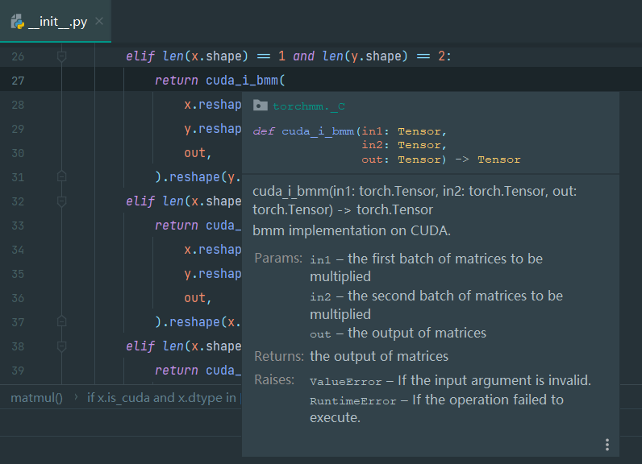

# PyTorch C++ 拓展 | 利用 CUTLASS 实现整数 GEMM 的 GPU 加速计算

## 引言

现存问题：整数通用矩阵乘法（GEMM）运算在隐私计算，尤其是基于多方安全计算技术的隐私保护机器学习中常用。PyTorch 是常用机器学习框架，但它不支持整数矩阵乘法的 GPU 加速，调用torch.matmul会报错，如"addmm_cuda" not implemented for 'Int'，致使安全多方计算中无法用 PyTorch 加速整数 GEMM 运算。

```python
import torch

mat1 = torch.randint(0, 256, (128, 128), device="cuda", dtype=torch.int32)
mat2 = torch.randint(0, 256, (128, 128), device="cuda", dtype=torch.int32)
print(torch.matmul(mat1, mat2))
# RuntimeError: "addmm_cuda" not implemented for 'Int'
```

为了解决上述问题，本文使用如下技术编写 torchmm 库，为 PyTorch 提供整数矩阵乘法加速计算：

1. 利用 NVIDIA 的 CUTLASS 库实现整数 GEMM 的 GPU 加速计算
2. 利用 torch extention实现C++和PyTorch的相互调用
3. 利用 pybind11 库封装 python 模块

torchmm 库的示例代码如下：

```python
import torch
import torchmm

mat1 = torch.randint(0, 256, (128, 128), device="cuda", dtype=torch.int32)
mat2 = torch.randint(0, 256, (128, 128), device="cuda", dtype=torch.int32)
print(torchmm.matmul(mat1, mat2))
```

## CUTLASS批量GEMM计算

利用 CUTLASS 中的 GemmBatched 可以实现批量 GEMM 计算。需要引入的头文件为：

```C++
#include <cutlass/cutlass.h>
#include <cutlass/gemm/device/gemm_batched.h>
```

此外，指定任务参数时，需定义两个输入矩阵及输出矩阵的数据类型和布局（行主序或列主序）。下面代码采用 scalar_t 类型，且输入输出矩阵均设为行主序。实际上，GemmBatched 支持更多模板参数，本文其余参数均用默认值。

```C++
using Gemm = cutlass::gemm::device::GemmBatched< //
    scalar_t,                                    //
    cutlass::layout::RowMajor,                   //
    scalar_t,                                    //
    cutlass::layout::RowMajor,                   //
    scalar_t,                                    //
    cutlass::layout::RowMajor                    //
    >;                                           //
```

之后定义 GEMM 对象，在 `<cutlass/gemm/device/gemm_batched.h>` 头文件中可找到 GemmBatched 的定义，关键在于下方重载的 operator()，其包含 3 个参数。需重点关注第一个参数 args 和第三个参数 stream，前者用于指定具体的 GEMM 任务，后者用于 CUDA 的多流优化。

```C++
/// Runs the kernel using initialized state.
Status operator()(
    Arguments const &args, 
    void *workspace = nullptr, 
    cudaStream_t stream = nullptr);
```

在同一文件中能看到 Arguments 类型的定义，需注意：

- problem_size_ 为 GEMM 输入输出矩阵尺寸，若计算任务是 (b, m, k) x (b, k, n)（b 为批处理数量），其值为 {m, n, k}。
- ref_A_ 是输入矩阵 A 的 TensorRef 类型，传入 A 的指针和 leading_dimension，行主序时为 {A.ptr, A.col_num}。
- stride_A_ 是每个 batch 的元素个数，A 对应的是 A.row_num x A.col_num。
- epilogue_ 是任务执行的额外参数，默认是 alpha 和 beta，即任务为 D = alpha x A x B + beta x C，计算 A x B 时令 alpha = 1 且 beta = 0

详细的内容都可以在CUTLASS源代码中的注释中找到。

```C++
/// Constructs an Arguments structure 
CUTLASS_HOST_DEVICE
Arguments(
      GemmCoord problem_size_,
      TensorRef<ElementA const, LayoutA> ref_A_,
      int64_t stride_A_,
      TensorRef<ElementB const, LayoutB> ref_B_,
      int64_t stride_B_,
      TensorRef<ElementC const, LayoutC> ref_C_,
      int64_t stride_C_,
      TensorRef<ElementC, LayoutC> ref_D_,
      int64_t stride_D_,
      typename EpilogueOutputOp::Params epilogue_,
      int batch_count_
    );
```

## PyTorch C++拓展

### 判断张量是否连续

调用 CUTLASS 前，要用 is_contiguous 函数确保传入张量连续。Torch 中，张量数据在内存以一维数组存储，其形状和步长决定如何从该数组提取多维数据。当张量内存布局与逻辑布局相符，称其为连续（contiguous）。transpose、permute、view等操作会改变逻辑布局但不改变内存布局，可能使张量不再连续。CUTLASS 传入不连续张量会出错，所以调用前需用 is_contiguous 函数检查。

### 适配不同的数据类型

Torch 里用宏定义 AT_DISPATCH_ALL_TYPES 可让模板函数自动适配不同整数数据类型，该宏接收 3 个参数，依次为输入张量数据类型、函数名称、函数体。函数体中能用模板类型 scalar_t 适配各类整数类型模板。其实，此宏展开后是一系列 switch-case 语句。

```C++
AT_DISPATCH_INTEGRAL_TYPES(dtype.toScalarType(), "cuda_bmm", [&] {
        using Gemm = cutlass::gemm::device::GemmBatched< //
            scalar_t,                                    //
            cutlass::layout::RowMajor,                   //
            scalar_t,                                    //
            cutlass::layout::RowMajor,                   //
            scalar_t,                                    //
            cutlass::layout::RowMajor                    //
            >;                                           //
        // do something
    });
```

最后对外暴露的接口形如

```C++
#ifndef TORCHMM_SCRS_CUDA_MATMUL_H
#define TORCHMM_SCRS_CUDA_MATMUL_H

#include <torch/extension.h>

namespace torchmm::cuda {

torch::Tensor& i_bmm(const torch::Tensor& in1,
                     const torch::Tensor& in2,
                     torch::Tensor&       out);

}; // namespace torchmm::cuda

#endif
```

## pybind11

### 编写C++文件

完成 Torch 函数实现后，要用 pybind11 包装成 Python 可调用模块，主要代码如下。pybind11 模块名固定使用TORCH_EXTENSION_NAME。定义函数用 m.def，传入 Python 函数名、C++ 函数体、Python 函数参数名和函数注释。按特定风格撰写函数注释，能在 PyCharm 等 IDE 实现漂亮的代码类型提示。



```C++
#include <torch/extension.h>

#include "cuda/matmul.h"

PYBIND11_MODULE(TORCH_EXTENSION_NAME, m)
{
    m.def("cuda_i_bmm",          //
          &torchmm::cuda::i_bmm, //
          py::arg("in1"),      //
          py::arg("in2"),      //
          py::arg("out"),      //
          R"(
bmm implementation on CUDA.

Args:
    in1 (torch.Tensor):     the first batch of matrices to be multiplied
    in2 (torch.Tensor):     the second batch of matrices to be multiplied
    out (torch.Tensor):     the output of matrices

Returns:
    torch.Tensor: the output of matrices

Raises:
    ValueError:   If the input argument is invalid.
    RuntimeError: If the operation failed to execute.
        )");
}
```

### 编写setup.py

PyTorch 有编写 setup.py 的模块，可用 torch.utils 辅助配置 CUDA 程序。CUTLASS 用 __cplusplus 宏判断 C++ 版本，但 Windows 的 MSVC 编译器将其定义为常数而非 C++ 版本，需手动指定编译参数 /Zc:__cplusplus，否则 CUDA 程序编译出错。

下方是 setup.py 的完整代码，

```python
from setuptools import setup, Extension, find_packages
from torch.utils import cpp_extension
import sys

cxx_flags = []
if sys.platform == "linux":
    cxx_flags = ["-std=c++17", "-O3"]
    nvcc_flags = ["-O3", "-std=c++17"]
else:
    cxx_flags = ["/std:c++17", "/O2", "/Zc:__cplusplus"]
    nvcc_flags = ["-O3", "-std=c++17", "-Xcompiler", "/Zc:__cplusplus"]

setup(
    name="torchmm",
    version="1.0.0",
    description="torch cuda matmul extension for integral",
    long_description=open("README.md", "r", encoding="utf-8").read(),
    long_description_content_type="text/markdown",
    author="oldprincess",
    author_email="zirui.gong@foxmail.com",
    packages=find_packages(exclude=("test", "examples")),
    ext_modules=[
        cpp_extension.CUDAExtension(
            name="torchmm" + "._C",
            sources=[
                "torchmm/csrc/cuda/matmul.cu",
                "torchmm/csrc/torchmm.cpp",
            ],
            include_dirs=["third_party/cutlass/include"],
            extra_compile_args={
                "cxx": cxx_flags,
                "nvcc": nvcc_flags,
            },
        )
    ],
    classifiers=[
        "Programming Language :: Python :: 3",
        "License :: OSI Approved :: MIT License",
        "Operating System :: OS Independent",
    ],
    cmdclass={"build_ext": cpp_extension.BuildExtension},
)
```

## 效果

测试环境

- OS：Windows 11
- Python：3.9
- NVCC Version: 12.6
- CPU：i5-12500H
- GPU：RTX 3050

下面是 int64 类型的测试结果，相比 CPU 的速度，CUDA 能够带来 50 倍左右的提升

```text
+-------------------------+-------------+-----------+-----------------+------------------+---------+
|          shape          |    dtype    | batchSize | cpuSpeed(ms/op) | cudaSpeed(ms/op) | speedUp |
+-------------------------+-------------+-----------+-----------------+------------------+---------+
| (256, 256) x (256, 256) | torch.int64 |     1     |     25.0042     |      2.8859      | 8.66426 |
| (256, 256) x (256, 256) | torch.int64 |     4     |    25.759825    |     0.74595      | 34.5329 |
| (256, 256) x (256, 256) | torch.int64 |     8     |    26.3211125   |    0.6243625     | 42.1568 |
| (256, 256) x (256, 256) | torch.int64 |     16    |    27.1207125   |    0.5632625     | 48.1493 |
| (256, 256) x (256, 256) | torch.int64 |     32    |    25.9527375   |    0.49336875    | 52.6031 |
| (256, 256) x (256, 256) | torch.int64 |     64    |  26.3745234375  |   0.459259375    | 57.4284 |
| (256, 256) x (256, 256) | torch.int64 |    128    |  27.35897109375 |  0.44845859375   | 61.0067 |
| (256, 256) x (256, 256) | torch.int64 |    256    |  26.89751171875 |  0.500232421875  |  53.77  |
+-------------------------+-------------+-----------+-----------------+------------------+---------+
```

## 参考

- CUTLASS. https://github.com/NVIDIA/cutlass
- PyTorch. Custom C++ and CUDA Extensions. https://pytorch.org/tutorials/advanced/cpp_extension.html
- pybind11 Documentation. https://pybind11.readthedocs.io/en/stable/index.html
- Google Python Style Guide. https://google.github.io/styleguide/pyguide.html#38-comments-and-docstrings
- Microsoft. /Zc:__cplusplus（启用更新的__cplusplus 宏）. https://learn.microsoft.com/zh-cn/cpp/build/reference/zc-cplusplus?view=msvc-170
